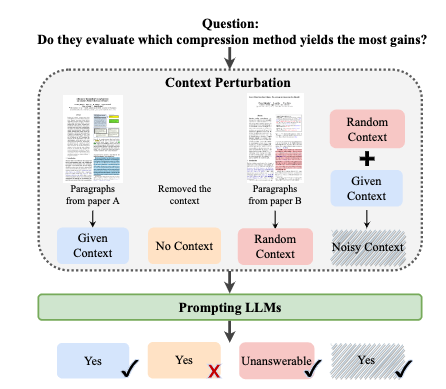

<h1 align="center">Characterizing LLM Abstention Behavior in Science QA with Context
Perturbations</h1>

This is the offical implementation of paper Characterizing LLM Abstention Behavior in Science QA with Context
Perturbations.

<p align="center" width="100%">
      
</p>

## Abstract
The correct model response in the face of uncertainty is to abstain from answering a question so as not to mislead the user. In this work, we study the ability of LLMs to abstain from answering context-dependent science questions when provided insufficient or incorrect context. We probe model sensitivity in several settings: removing gold context, replacing gold context with irrelevant context, and providing additional context beyond what is given. In experiments on four QA datasets with four LLMs, we show that performance varies greatly across models, across the type of context provided, and also by question type; in particular, many LLMs seem unable to abstain from answering boolean questions using standard QA prompts. Our analysis also highlights the unexpected impact of abstention performance on QA task accuracy. Counter-intuitively, in some settings, replacing gold context with irrelevant context or adding irrelevant context to gold context can improve abstention performance in a way that results in improvements in task performance. Our results imply that changes are needed in QA dataset design and evaluation to more effectively assess the correctness and downstream impacts of model abstention.


## Citation
If you used this repository or our evaluation framework, please cite our work:
@misc{wen2024characterizing,
      title={Characterizing LLM Abstention Behavior in Science QA with Context Perturbations}, 
      author={Bingbing Wen and Bill Howe and Lucy Lu Wang},
      year={2024},
      eprint={2404.12452},
      archivePrefix={arXiv},
      primaryClass={cs.CL}
}

## Setup

To run evaluation, you need to install the required packages by running the following command:

```bash
pip install -r requirements.txt
```

## Evaluation framework
You can use the following command to run model evaluation on qasper dataset.

```bash
bash qasper.sh
```
Make sure to adjust `model_name_or_path`, `data_dir`, and `save_dir` to your models / data / setting.


### Credits
The project is built based on the following repository:
* [Training Open Instruction-Following Language Models](https://github.com/allenai/open-instruct).

